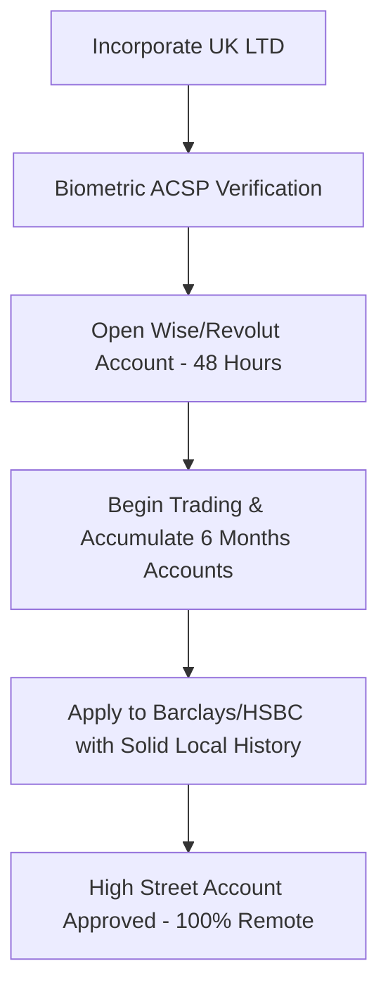

# Opening a Traditional UK Corporate Bank Account: Barclays, HSBC, and Lloyds (2026)

For local UK business owners and international founders alike, holding a bank account with a premier "High Street" institution—such as **Barclays, HSBC, Lloyds, or NatWest**—represents the gold standard of corporate credibility. 

While Electronic Money Institutions (EMIs) like Wise and Revolut are exceptional for fast launches and cross-border agility, traditional banks remain highly desirable. They unlock substantial corporate lending, commercial credit cards, local treasury services, and establish immense trust with venture capital (VC) investors and large B2B suppliers.

However, in 2026, traditional banks apply the strictest compliance filters in the world. For non-residents, navigating this onboarding process requires deep regulatory understanding.

This master guide details the eligibility rules, minimum deposit requirements, compliance hurdles, and the specialized **"Speed-to-Scale"** strategy to secure a traditional UK business bank account in 2026.

---

## 🏛️ The High Street Giants: A Strategic Overview

Each of the major UK clearing banks caters to distinct business profiles:

### 1. HSBC UK (The Global Trade Specialist)
HSBC is historically the most friendly traditional bank toward businesses with cross-border trade, import/export frameworks, and international supply chains.
*   **Best For:** E-commerce businesses with suppliers in Asia, global distributors, and entities expanding into multiple continental markets.
*   **Asset:** Extremely robust global online banking platform.

### 2. Barclays (The Startup & VC Favorite)
Barclays is heavily integrated into the UK's tech startup ecosystem. Their specialized "Barclays Eagle Labs" provide incubator support and venture lending.
*   **Best For:** Tech-enabled startups, SaaS agencies, and founders looking to raise venture capital or institutional investment.
*   **Asset:** Seamless integration with standard UK payroll and pension schemes.

### 3. Lloyds Banking Group (The Small Business Champion)
Lloyds is renowned for providing dedicated, local relationship managers to small and medium enterprises (SMEs) across Great Britain.
*   **Best For:** High-street retail, local logistics, professional service firms, and physical UK operations.
*   **Asset:** Highly competitive fee tiers for local sterling transaction handling.

---

## 🚫 The Residency Barrier & The "International Account" Path

To protect themselves from massive regulatory fines associated with international money laundering, traditional banks enforce highly stringent residency policies.

### The "UK Resident Director" Rule
If your company has **at least one active director residing legally in the UK**, you can easily apply for standard corporate accounts online or at a local branch. Approval takes **2 to 4 weeks**, and monthly fees are low (£5 - £10).

### The "International / Offshore" Route
If **all company directors reside outside the UK**, traditional banks immediately route your application to their specialized *International Business* or *Offshore Corporate* divisions (usually situated in Jersey, Guernsey, or the Isle of Man). 

This route triggers immense compliance filters:
*   **Stiff Minimum Deposits:** You must maintain a continuous minimum balance, typically between **£25,000 and £50,000** (or currency equivalent) to keep the account open.
*   **Physical Branch Verification:** Some institutions still require the primary managing director to visit a UK branch or a global partner office in person to verify their original physical documents.
*   **High Monthly Fees:** International corporate accounts typically carry monthly administration charges ranging from **£20 to £100+**, alongside fixed transaction fees.

---

## 🛠️ Step-by-Step KYC Checkpoints for High Street Approval

To survive a traditional bank’s manual compliance audit in 2026, your UK company must provide a flawless application package:

### 1. Verified Corporate Structure
Traditional banks will manually query the Companies House register and cross-reference your filing history.
*   **Biometric ACSP Verification:** You must demonstrate that all directors and PSCs have successfully completed their biometric identity verification under the 2026 ECCTA rules.
*   **Physical Office Footprint:** You must use an appropriate, physical UK Registered Office Address. High street banks will instantly decline applications linked to PO Boxes or flagged "mass-address" farms.

### 2. Financial History & Proof of Address
*   **Proof of Residential Address:** Provide original utility bills or official tax documents dated within the last 90 days. Bank statements from online neo-banks are occasionally rejected for high-street international applications.
*   **Trading History:** Be prepared to present a detailed, professional business plan containing projected annual turnover, transaction volumes, and sources of incoming corporate wealth.

---

## ⚖️ The "Speed-to-Scale" Strategy (Highly Recommended)

Because traditional bank approval for non-residents takes **4 to 8 weeks** and carries a high risk of rejection, we advise against applying to High Street banks immediately after incorporation.

Instead, execute our highly successful **Speed-to-Scale** framework:

### Why this works:
1.  **Immediate Cash Flow:** By opening a digital EMI account (such as Wise or Revolut Business) within 48 hours of formation, you can begin receiving customer payments and paying suppliers immediately.
2.  **Trade History Accumulation:** After 6 to 12 months of clean operations, you will have official corporate tax files, structured bank statements, and clear evidence of legitimate UK business activities.
3.  **Low Friction Transition:** When you present this established trading record to HSBC or Barclays, their risk underwriting team sees your company as a verified, active commercial entity rather than a risky "shell" company, leading to a much higher approval rate with zero deposit stress.

---

## 🚀 Future-Proof Your Corporate Structure

A prestigious high-street banking account requires a flawless legal foundation. At UK Ltd Registration, we handle all compliance steps—incorporating your business, providing appropriate premium Registered Office Addresses in London, and registering biometric files to guarantee your company is built to meet the highest banking standards.

[**Incorporate Your UK Ltd & Access Premium Corporate Setup →**](/pricing)
[**Schedule a Consultation with a Compliance Expert →**](/contact)
